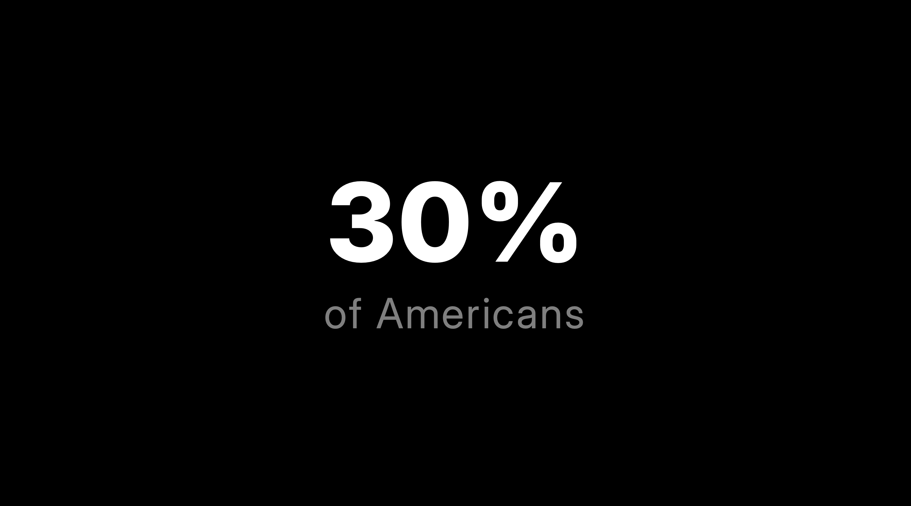
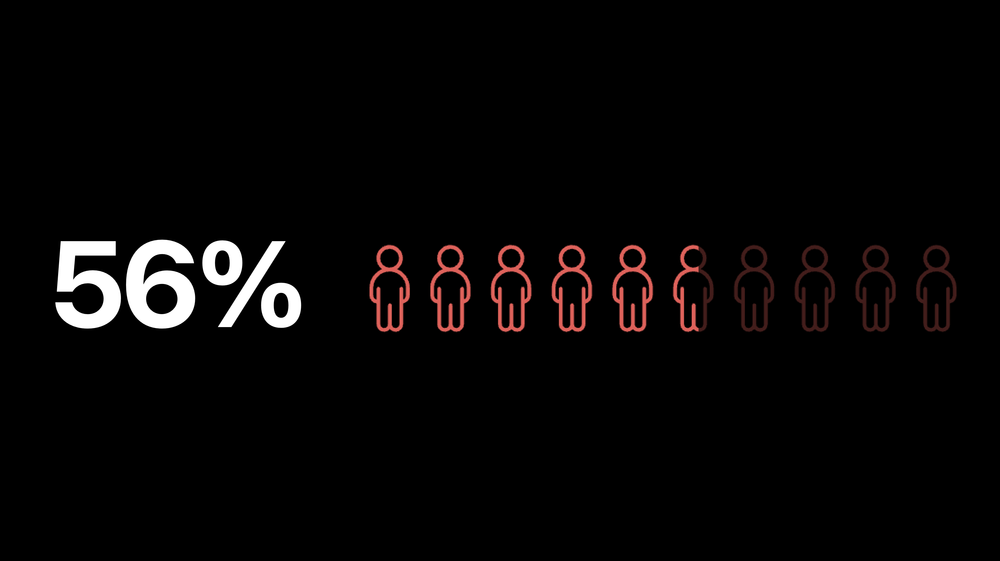
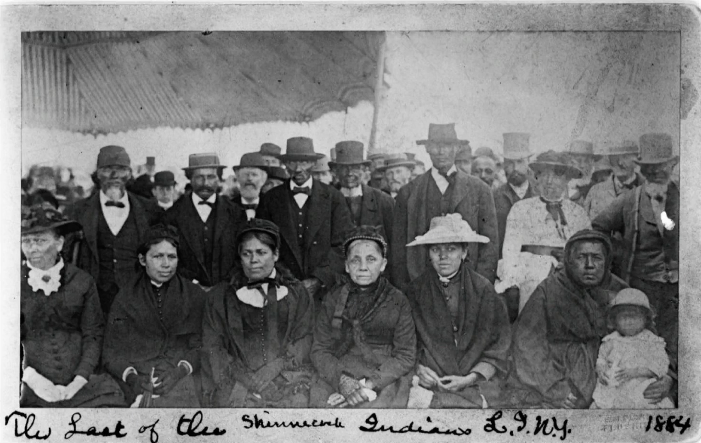
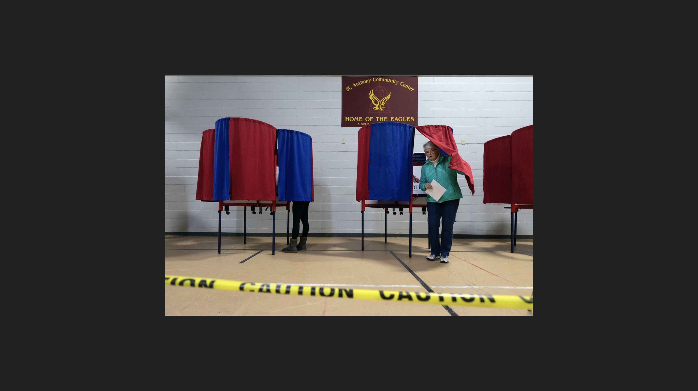

# 🎨 Design Brilliant Slides


If you haven't seen our [Slides & A/V](../slides-and-a-v.md) article yet, go read that first!


***

## DO: Start with a Black Screen

DON'T: Start with a title slide.

<figure><figcaption>
<strong>GOOD:</strong> <em>What happens next?!</em>
</figcaption></figure> <figure><figcaption>
<strong>BAD:</strong> <em>Boring intro that gives away your talk.</em>
</figcaption></figure>

Design your talk to **start from a black screen**. Why?

1. Audiences prefer a talk that starts with the bulk of the idea (also called _in medias res_) or starts with an example that expands into the idea. Designing from a black slide encourages this.&#x20;
2. Title slides often cause presenters to say "So today I'm talking about..." (Absolutely, no. Never.)

***

## DO: Use Clean, Non-Distracting Fonts

DON'T: Use hard-to-read, distracting fonts

<figure><figcaption>
<strong>GOOD:</strong> The Inter font is used, and text size draws your eyes to what's important
</figcaption></figure> <figure><figcaption>
<strong>BAD:</strong> The font is difficult to read from the audience
</figcaption></figure>

Our team will change presentation fonts to use the Inter font family. We recommend designing your slides from the beginning with this font. You can download Inter for free [**from Google Fonts**](https://fonts.google.com/specimen/Inter?query=inter).

Because we change fonts for audience experience and accessibility reasons, if you **must** use a particular font, let us know and provide a concrete reason for its use.

***

## DO: Get Rid of the Text! (Or Use Very Little)

DON'T: Use paragraphs or bulleted lists

<figure><figcaption>
<strong>GOOD:</strong> Short call to action
</figcaption></figure> <figure><figcaption>
<strong>GOOD:</strong> Data is the focus; a graphic helps visualise just what 56% looks like
</figcaption></figure> <figure><figcaption>
<strong>BAD:</strong> Overwhelming. Way too much text.
</figcaption></figure>

You're there to give the talk, share the content, and tell the narrative. You should be able to give the presentation **entirely without text on the screen.** Start with that mindset. Then, add occasional words here or there if necessary to communicate a point.

***

## DO: Use Photos & Videos that Supports your Talk

DON'T: Use stock images or filler images

<figure><figcaption>
<strong>GOOD:</strong> <em>A poignant image relevant to the talk</em>
</figcaption></figure> <figure><figcaption>
<strong>BAD:</strong> <em>It's meaningless! Just use a blank slide at this point.</em>
</figcaption></figure>

Use content that's relevant and won't detract from your talk. Using stock images or putting an image "because there was empty space" should be avoided at all costs.

If you don't have imagery/video for a slide or topic, use a blank slide to redirect the audience's focus back to you (and away from the screen).

Videos or GIFs with rapid flashing will be removed from your slides, as they can **cause physical harm** to audience members with photosensitive epilepsy and other photosensitive conditions.

***

## DO: Let Photos and Video Fill the Screen

DON'T: Make them small, change their shape, add a border, etc.


(30 sec. Clip) **GOOD:** _Notice how the photos take up all available space and the video fills the screen._&#x20;


<figure><figcaption>
<strong>BAD:</strong> <em>Rounding and positioning are distracting and irrelevant.</em>
</figcaption></figure> <figure><figcaption>
<strong>BAD:</strong> <em>Why is there all that space around the image? Make it big!</em>
</figcaption></figure> <figure><figcaption>
<strong>BAD:</strong> AAH! Too much info! Distill it down or communicate it another way.
</figcaption></figure>

Now that you have only images and videos that support your talk, you want them seen! Don't let fancy design or whitespace/margining/borders distract from the very important content.

***

## DO: Use minimal-to-no animations

DON'T: Distract the audience with fancy animations/transitions

Any transitions other than a simple fade, Morph (in PowerPoint), or Magic Move (in Keynote) will be removed unless there's a good reason for their use. Animations&#x20;

At least destructive, animations and transitions can **distract the audience**. At most destructive, excessive animations and transitions can **cause physical harm** to audience members with photosensitive epilepsy and other photosensitive conditions.

***

## DO: Share Ideas & Ask Questions

DON'T: Wait until the last minute

Have ideas or questions about presenting? Your curator can make sure your questions gets to the right people to have it answered! The Technical Production team plans and manages media for the event. We're happy to provide support and answer questions!

